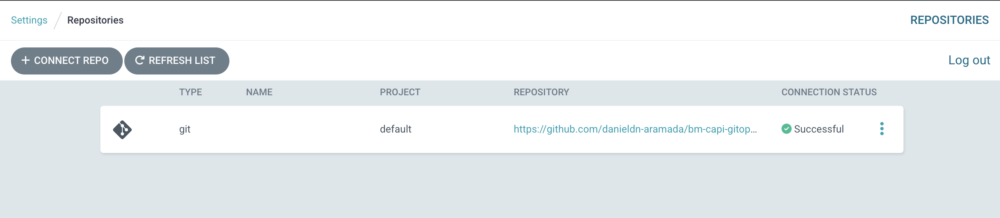
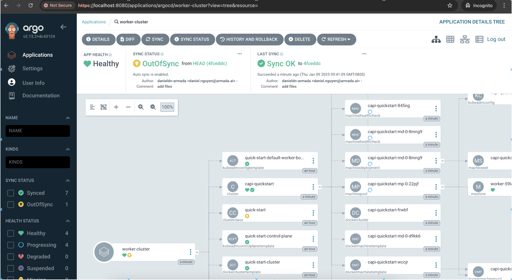
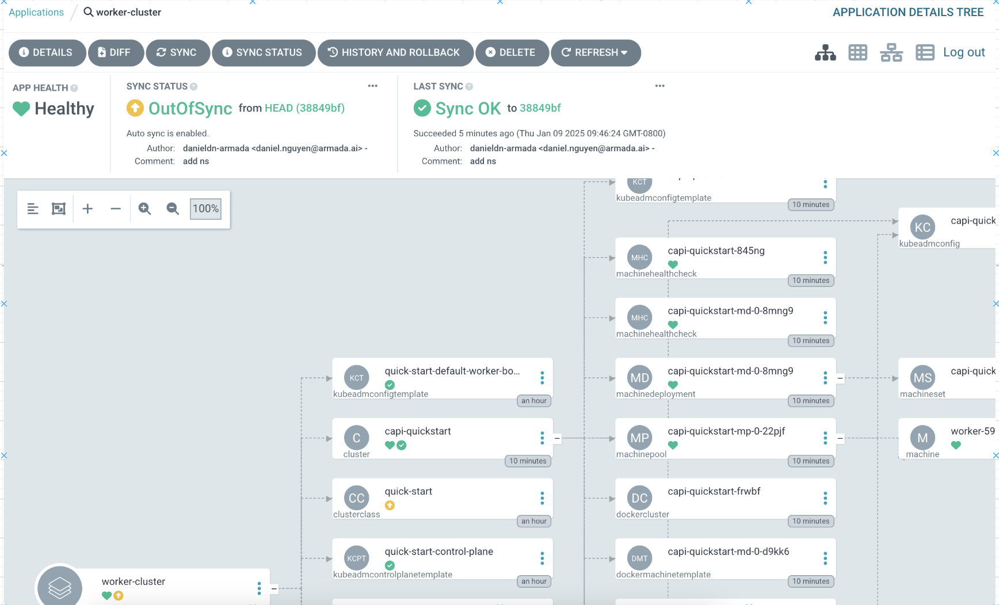
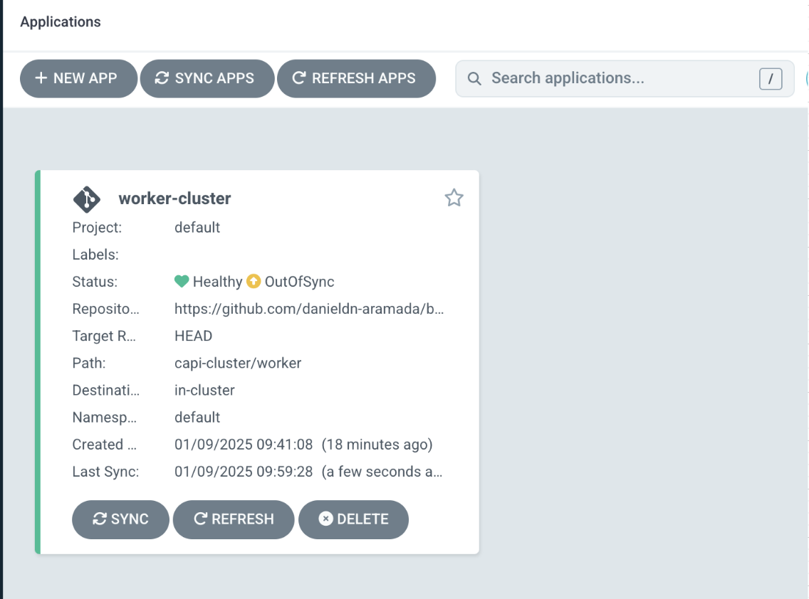
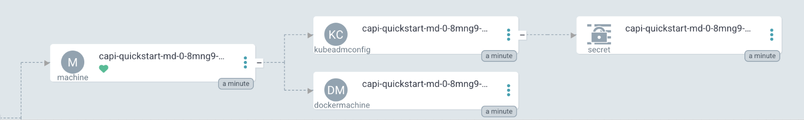

# CAPI Gitops Demo

Local demo of argo cd gitops to create (and manage lifecycle of) capi worker clusters

This assumes a local CAPI mangement cluster (using Kind and clusterctl init --provider docker)

Install ArgoCD on mgmt cluster
```bash
# install argo cd
kubectl create namespace argocd
kubectl apply -n argocd -f https://raw.githubusercontent.com/argoproj/argo-cd/stable/manifests/install.yaml

# fetch argo cd password
kubectl -n argocd get secret argocd-initial-admin-secret -o json | jq -r '.data.password' | base64 --decode

# login to argo ui 
kubectl port-forward svc/argocd-server -n argocd 8080:443
http://localhost:8080/
```

Register github repo in Argo. For this demo, we used a personal github access token as `password`


Create our ArgoCD Application for this worker cluster (can also be done manually in Argo UI)
```
kubectl apply -f management/argo-worker-app.yaml
```

The application status is initially in OutOfSync state since the application has yet to be deployed, and no Kubernetes resources have been created.

Click sync. Sync retrieves the manifests from this repository and performs a `kubectl apply`.



Continue viewing the worker cluster being created




Once done, we edit the worker cluster yaml to increase the node count from 1 to 2 and
push the commit to this repo.

```
# edit node count in capi-cluster/worker.yaml
# commit changes
git add .
git commit -m "change worker node count from 1 to 2"
git push origin main
```

View sync of our Argo Application taking place



View resources created

